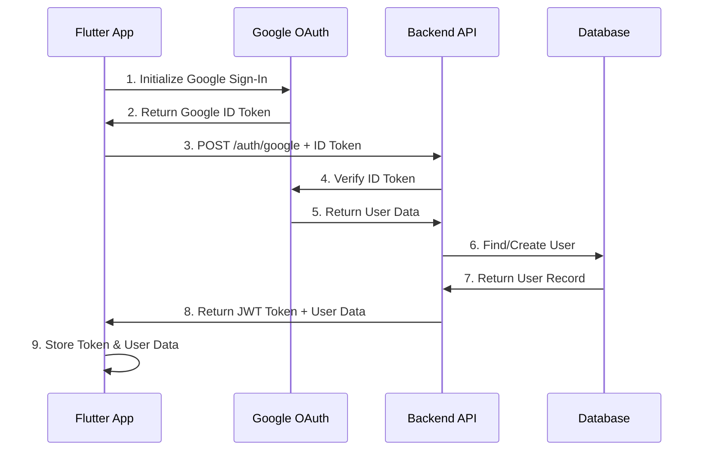
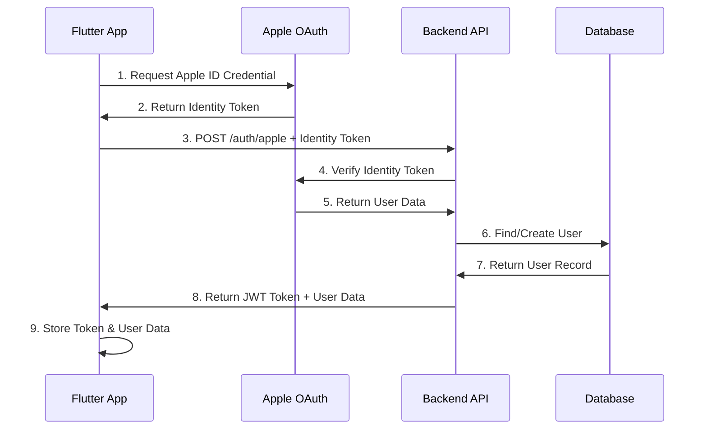

# Flutter + Backend OAuth Integration Guide

This guide shows how to integrate the Flutter OAuth service with the Node.js backend for a complete authentication flow.

## 🚀 Quick Start

### 1. Start the Backend Server

```bash
cd oauth-backend
npm install
npm run dev
```

The server will start on `http://localhost:3000`

### 2. Update Flutter Dependencies

```bash
cd ../  # Go back to Flutter project root
flutter pub get
```

### 3. Test the Integration

```bash
cd oauth-backend
node test-integration.js
```

## 🔄 Complete OAuth Flow

### Google Sign-In Flow



### Apple Sign-In Flow



## 📱 Flutter Integration

### Updated OAuth Service Features

The updated `OAuthService` now includes:

1. **Backend API Integration**

   - Sends OAuth tokens to backend for verification
   - Receives JWT tokens for authentication
   - Stores tokens securely using SharedPreferences

2. **Device Information Collection**

   - Automatically collects device info (OS, model, app version)
   - Sends device info to backend for tracking

3. **Token Management**

   - JWT token storage and retrieval
   - Token refresh functionality
   - Automatic token inclusion in API requests

4. **User Profile Management**
   - Get user profile from backend
   - Update user profile
   - Check authentication status

### Key Methods

```dart
// Sign in with Google (now uses backend)
final result = await oauthService.signInWithGoogle();

// Sign in with Apple (now uses backend)
final result = await oauthService.signInWithApple();

// Check if user is authenticated
final isAuth = await oauthService.isAuthenticated();

// Get user profile from backend
final profile = await oauthService.getUserProfile();

// Update user profile
final updated = await oauthService.updateUserProfile(
  firstName: 'John',
  lastName: 'Doe',
);

// Refresh JWT token
final token = await oauthService.refreshToken();

// Sign out (clears all data)
await oauthService.signOut();
```

## 🔧 Backend Configuration

### Environment Variables

Create a `.env` file in the `oauth-backend` directory:

```env
# Server Configuration
PORT=3000
NODE_ENV=development

# JWT Configuration
JWT_SECRET=your-super-secret-jwt-key-here
JWT_EXPIRES_IN=7d

# Google OAuth Configuration
GOOGLE_CLIENT_ID=your-google-client-id
GOOGLE_CLIENT_SECRET=your-google-client-secret

# Apple OAuth Configuration
APPLE_CLIENT_ID=your-apple-client-id
APPLE_TEAM_ID=your-apple-team-id
APPLE_KEY_ID=your-apple-key-id
APPLE_PRIVATE_KEY_PATH=./keys/AuthKey_XXXXXXXXXX.p8

# Database Configuration (Optional)
MONGODB_URI=mongodb://localhost:27017/trakli-oauth

# CORS Configuration
ALLOWED_ORIGINS=http://localhost:3000,https://your-app-domain.com
```

### API Endpoints

| Method   | Endpoint            | Description         |
| -------- | ------------------- | ------------------- |
| `POST`   | `/api/auth/google`  | Google Sign-In      |
| `POST`   | `/api/auth/apple`   | Apple Sign-In       |
| `POST`   | `/api/auth/refresh` | Refresh JWT Token   |
| `POST`   | `/api/auth/logout`  | Logout              |
| `GET`    | `/api/user/profile` | Get User Profile    |
| `PUT`    | `/api/user/profile` | Update User Profile |
| `GET`    | `/api/user/stats`   | Get User Statistics |
| `DELETE` | `/api/user/account` | Deactivate Account  |

## 🧪 Testing the Integration

### 1. Backend Health Check

```bash
curl http://localhost:3000/health
```

Expected response:

```json
{
  "status": "OK",
  "timestamp": "2024-01-01T00:00:00.000Z",
  "uptime": 123.456,
  "environment": "development"
}
```

### 2. Test Google OAuth

```bash
curl -X POST http://localhost:3000/api/auth/google \
  -H "Content-Type: application/json" \
  -d '{
    "idToken": "your-google-id-token",
    "deviceInfo": {
      "deviceId": "test-device",
      "deviceType": "mobile",
      "appVersion": "1.0.0",
      "osVersion": "iOS 17.0"
    }
  }'
```

### 3. Test Apple OAuth

```bash
curl -X POST http://localhost:3000/api/auth/apple \
  -H "Content-Type: application/json" \
  -d '{
    "identityToken": "your-apple-identity-token",
    "userInfo": {
      "firstName": "John",
      "lastName": "Doe",
      "email": "john@example.com"
    },
    "deviceInfo": {
      "deviceId": "test-device",
      "deviceType": "mobile",
      "appVersion": "1.0.0",
      "osVersion": "iOS 17.0"
    }
  }'
```

## 🔒 Security Features

### JWT Token Security

- Tokens are signed with a secret key
- Configurable expiration time
- Automatic token refresh
- Secure storage in SharedPreferences

### OAuth Token Verification

- Google ID tokens are verified against Google's servers
- Apple identity tokens are verified against Apple's servers
- Nonce validation for Apple Sign-In
- Replay attack prevention

### API Security

- Rate limiting to prevent abuse
- CORS protection
- Input validation
- Error handling without information leakage

## 📊 Monitoring and Logging

### Backend Logs

The backend provides comprehensive logging:

- OAuth token verification
- User creation/updates
- API request/response
- Error tracking

### Flutter Logs

The Flutter service logs:

- OAuth flow steps
- Backend API calls
- Token management
- Error handling

## 🚀 Production Deployment

### Backend Deployment

1. Set production environment variables
2. Use a production database (MongoDB Atlas)
3. Configure proper CORS origins
4. Use HTTPS for all endpoints
5. Set up monitoring and logging

### Flutter App Deployment

1. Update backend URL to production endpoint
2. Configure OAuth credentials for production
3. Test on real devices
4. Monitor authentication success rates

## 🐛 Troubleshooting

### Common Issues

1. **Backend Connection Failed**

   - Check if server is running
   - Verify URL in Flutter app
   - Check network connectivity

2. **OAuth Token Verification Failed**

   - Verify OAuth credentials
   - Check token format
   - Ensure proper scopes

3. **JWT Token Issues**
   - Check JWT_SECRET configuration
   - Verify token expiration
   - Clear stored tokens and re-authenticate

### Debug Mode

Enable debug logging:

```dart
// In Flutter app
logger.d('Debug message');
```

```javascript
// In backend
console.log("Debug message")
```

## 📈 Performance Optimization

### Backend Optimizations

- Database indexing
- Connection pooling
- Caching strategies
- Rate limiting

### Flutter Optimizations

- Token caching
- Offline authentication checks
- Background token refresh
- Efficient API calls

## 🔄 Migration from Firebase-Only

If you're migrating from Firebase-only authentication:

1. **Update OAuth Service**: The service now uses backend API
2. **Update UI Components**: No changes needed
3. **Update State Management**: Handle JWT tokens instead of Firebase tokens
4. **Update API Calls**: Use JWT tokens for authenticated requests

## 📚 Additional Resources

- [Google OAuth Documentation](https://developers.google.com/identity/protocols/oauth2)
- [Apple Sign-In Documentation](https://developer.apple.com/sign-in-with-apple/)
- [JWT Token Best Practices](https://tools.ietf.org/html/rfc7519)
- [Flutter HTTP Client Guide](https://pub.dev/packages/dio)

